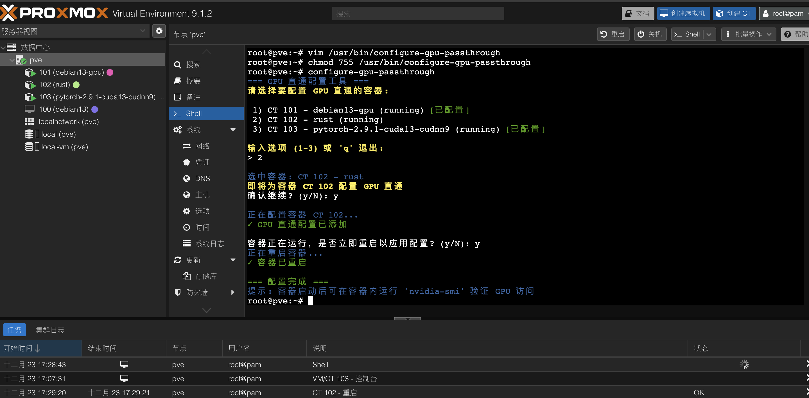
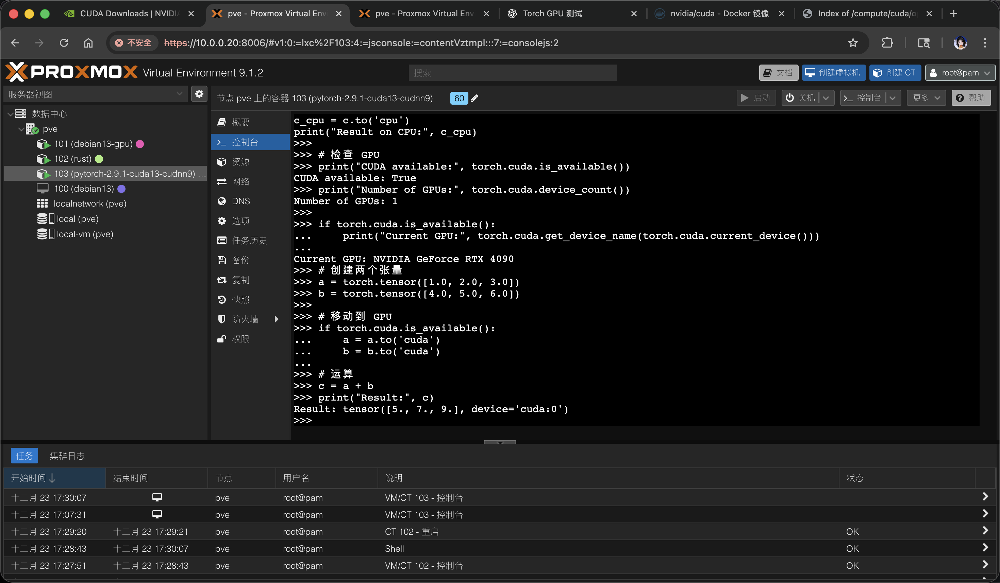
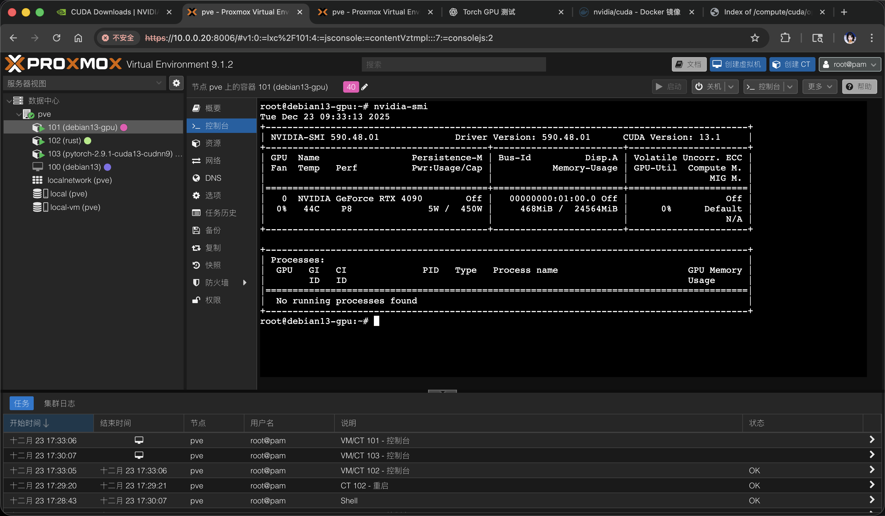

# PVE-GPU-Passthrough-LXC

Proxmox VE NVIDIA GPU 直通到 LXC 容器的自动化配置工具。

## 项目优势
- **零驱动安装** - 容器内无需安装任何 NVIDIA 驱动，一键配置完成
- **官方实现** - 基于 NVIDIA 官方方案，零性能损耗，无虚拟化映射问题  
- **OCI 兼容** - 直接支持官方 Docker 镜像，无需额外配置
- **多 GPU 支持** - 完整支持多卡环境和资源分配
- **嵌套容器** - 支持 LXC 内运行 Docker 并访问所有 GPU 资源







## 快速开始

```bash
git clone https://github.com/Xingsandesu/PVE-GPU-Passthrough-LXC.git
```
```bash
cd PVE-GPU-Passthrough-LXC
```
## 系统要求

- Proxmox VE 9.1环境
- NVIDIA GPU 硬件
- 支持 IOMMU 的主板和 CPU

## 配置步骤

### 1. 系统初始化

更新系统包：
```
apt update
```

### 2. 存储配置（可选）

移除默认的 LVM 存储并扩展根分区：

```bash
# 移除默认的 data 逻辑卷
lvremove pve/data

# 扩展根分区使用全部可用空间
lvextend -l +100%FREE -r pve/root

# 移除 local-lvm 存储
pvesm remove local-lvm

# 创建本地虚拟机存储目录
mkdir /local-vm
pvesm add dir local-vm --content images,iso,vztmpl,backup,rootdir,snippets -preallocation off --path /local-vm
```

### 3. 启用 IOMMU 支持

配置内核参数启用 IOMMU：

```bash
if [ `grep -c "intel_iommu=on" /etc/default/grub` -ne '1' ];then
  sed -i 's/quiet/quiet intel_iommu=on/' /etc/default/grub
  update-grub
fi
```

### 4. 配置 VFIO 模块

启用 VFIO 并禁用 nouveau 驱动：

```bash
# 添加 VFIO 模块
echo -e "vfio\nvfio_iommu_type1\nvfio_pci\nvfio_virqfd" >> /etc/modules

# 禁用 nouveau 驱动
echo "blacklist nouveau" >> /etc/modprobe.d/blacklist.conf

# 更新 initramfs
update-initramfs -u -k all
rmmod nouveau
```

### 5. 安装 NVIDIA 驱动

安装必要的头文件和驱动：

```bash
# 安装内核头文件
apt install pve-headers-$(uname -r)

# 添加 NVIDIA 官方仓库密钥
wget https://developer.download.nvidia.com/compute/cuda/repos/${distro}/x86_64/cuda-keyring_1.1-1_all.deb
dpkg -i cuda-keyring_1.1-1_all.deb
apt update

# 安装 NVIDIA 驱动
apt -V install nvidia-driver-cuda nvidia-kernel-dkms
```

### 6. 安装 NVIDIA Container Toolkit

在宿主机上安装容器工具包：

```bash
apt update && apt install -y gpg curl --no-install-recommends
curl -fsSL https://nvidia.github.io/libnvidia-container/gpgkey | gpg --dearmor > /usr/share/keyrings/nvidia-container-toolkit-keyring.gpg

rm -f /etc/apt/sources.list.d/nvidia-container-toolkit.list
cat <<EOF > /etc/apt/sources.list.d/nvidia-container-toolkit.sources
Types: deb
URIs: http://nvidia.github.io/libnvidia-container/stable/deb/amd64/
Suites: /
Components:
Signed-By: /usr/share/keyrings/nvidia-container-toolkit-keyring.gpg
EOF

apt update && apt install -y nvidia-container-toolkit

systemctl status docker.service >/dev/null 2>&1 && nvidia-ctk runtime configure --runtime=docker

# LXC 环境特殊配置
if [[ $(systemd-detect-virt) == "lxc" ]]; then
  nvidia-ctk config -i --set nvidia-container-cli.no-cgroups=true
fi

systemctl status docker.service >/dev/null 2>&1 && systemctl restart docker.service
```

## LXC 容器配置

### 1. 创建 LXC 容器

使用社区脚本创建 Debian 13 容器：

```bash
bash -c "$(curl -fsSL https://raw.githubusercontent.com/community-scripts/ProxmoxVE/main/ct/debian.sh)"
```

### 2. 配置 GPU 直通

使用交互式脚本简化 GPU 直通配置流程：

```bash
# 克隆仓库并安装脚本
sudo cp configure-gpu-passthrough /usr/bin/configure-gpu-passthrough
sudo chmod +x /usr/bin/configure-gpu-passthrough
```

运行配置：

```bash
configure-gpu-passthrough
```

**脚本优势：**
- **智能检测** - 自动扫描现有容器并显示配置状态
- **可视化选择** - 清晰的容器列表，已配置项目高亮显示
- **安全操作** - 自动备份配置文件，支持重复配置
- **一键完成** - 从选择到配置重启全程自动化
- **错误处理** - 完善的权限检查和异常处理机制

### 3. 验证 GPU 访问

在容器内验证 GPU 可访问性：

```bash
nvidia-smi
```

## 容器内配置

### 1. 安装基础工具

```bash
apt update
apt install vim nvtop curl wget -y
```

### 2. 安装 Docker

```bash
curl -fsSL https://get.docker.com -o get-docker.sh
sh get-docker.sh
docker info
```

### 3. 安装 NVIDIA Container Toolkit

在容器内安装容器工具包：

```bash
apt update && apt install -y gpg curl --no-install-recommends
curl -fsSL https://nvidia.github.io/libnvidia-container/gpgkey | gpg --dearmor > /usr/share/keyrings/nvidia-container-toolkit-keyring.gpg

rm -f /etc/apt/sources.list.d/nvidia-container-toolkit.list
cat <<EOF > /etc/apt/sources.list.d/nvidia-container-toolkit.sources
Types: deb
URIs: http://nvidia.github.io/libnvidia-container/stable/deb/amd64/
Suites: /
Components:
Signed-By: /usr/share/keyrings/nvidia-container-toolkit-keyring.gpg
EOF

apt update && apt install -y nvidia-container-toolkit

systemctl status docker.service >/dev/null 2>&1 && nvidia-ctk runtime configure --runtime=docker

# LXC 环境特殊配置
if [[ $(systemd-detect-virt) == "lxc" ]]; then
  nvidia-ctk config -i --set nvidia-container-cli.no-cgroups=true
fi

systemctl status docker.service >/dev/null 2>&1 && systemctl restart docker.service
```

## 测试验证

在容器内运行测试容器验证 GPU 功能：

```bash
docker run --rm --runtime=nvidia --gpus all ubuntu nvidia-smi
```

## 注意事项

1. 确保在执行配置前备份重要数据
2. 某些步骤需要重启系统才能生效
3. 根据实际硬件配置调整相关参数
4. 定期更新驱动程序以获得最佳性能

## 故障排除

如果遇到问题，请检查：

- IOMMU 是否正确启用
- VFIO 模块是否正确加载
- 容器配置文件是否正确修改
- GPU 驱动是否正确安装

通过 `dmesg` 和系统日志可以获取更多调试信息。